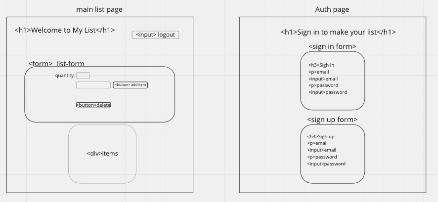

## The Golden Rule:

🦸 🦸‍♂️ `Stop starting and start finishing.` 🏁

If you work on more than one feature at a time, you are guaranteed to multiply your bugs and your anxiety.

## Making a plan

1. **Make a drawing of your app. Simple "wireframes"**
1. **Once you have a drawing, name the HTML elements you'll need to realize your vision**
1. **For each HTML element ask: Why do I need this?**
1. **Once we know _why_ we need each element, think about how to implement the "Why" as a "How"**
1. **Find all the 'events' (user clicks, form submit, on load etc) in your app. Ask one by one, "What happens when" for each of these events. Does any state change?**
1. **Think about how to validate each of your features according to a Definition of Done**
1. **Consider what features _depend_ on what other features. Use this dependency logic to figure out what order to complete tasks.**

Additional considerations:

-   Ask: which of your HTML elements need to be hard coded, and which need to be dynamically generated?
-   Consider your data model.
    -   What kinds of objects (i.e., Dogs, Friends, Todos, etc) will you need?
    -   What are the key/value pairs?
    -   What arrays might you need?
    -   What needs to live in a persistence layer?
-   Is there some state we need to initialize?
-   Ask: should any of this work be abstracted into functions? (i.e., is the work complicated? can it be reused?)

## plan

what needs to be done:
- add items
- cross out once completed
- delete list
- login
- logout
- create acct
- login

table plan: shopping_list
- id
- created at
- item - text
- quantity - int2
- purchased? bool, false by default
- user_id - uuid

## html

auth page:
- login/out forms

list page:
- logout button up top
    - log the user out while saving their data
- quantity dropdown
    - choose a #
- item input
    - type in text of an item
- add item button
    - render an item and add it to the list div
- div for list
    -make all of the items show up, can cross them off when completed 
- delete button
    - deletes the items in the div

## slices / features / user stories

1. on submit, user should be able to add an item and its quantity (<input name="quantity"/>)
- get form data in a submit listener
    --do all the form stuff:
    - e.preventDefault(), 'submit', const data = new FormData(myFormEl);, data.get('quantity')
    -using the form data, we send that data to supabase to create a new list_item
2. on submit, user should be able to see the items they added, (but only THEIR OWN ITEMS)
    -after creating a new item,
        -fetch the user's list items
        -put them in steate
        -clear the DOM out
        -and re-display the list_items 
3. on click of an item, user should be able to designate the item as "bought", (but only THEIR OWN ITEMS)
    -after we render each item, add an event listener
        -on click of the item, call supabase to update the item by id
        -fetch the user's list items
        -put them in steate
        -clear the DOM out
        -and display the list_items 
4. on load, fetch, render, and append the items the user already added in the past, (but only THEIR OWN ITEMS)
    -fetch the user's list items
    -put them in steate
    -clear the DOM out
    -display the list_items

5. when rendering the list, items that are 'bought' should be -rendered differently, (but only THEIR OWN ITEMS)
    -in our renderListItem function
    -look at the boolean is_bought
    -if is_bought is true, put a new class on the element
4. on load, if user is logged in, display the email in header